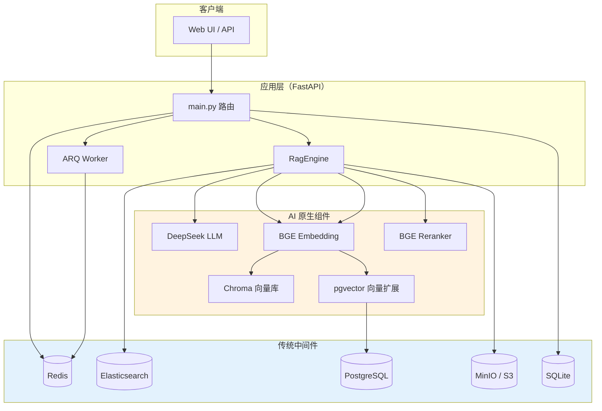

# 中间件专题：角色、分类与选型

> **专题定位**：讲清本项目中每一类中间件/组件**承担什么职责**、**是否因 AI 引入**、**功能等价物有哪些**、**优缺点如何权衡**。  
> 部署操作见 [`../enterprise/MIDDLEWARE_SETUP.md`](../enterprise/MIDDLEWARE_SETUP.md)；架构总览见 [`ARCHITECTURE.md`](ARCHITECTURE.md)。

---

## 1. 一句话总览

```
用户请求
  → FastAPI（传统 Web）
  → RAG Pipeline（AI 编排）
      → Embedding 模型（AI）→ 向量库 Chroma/pgvector（AI 检索底座）
      → ES BM25（传统全文，为 hybrid 服务）
      → Rerank 模型（AI 精排）
      → LLM DeepSeek（AI 生成）
  → Redis（传统缓存/队列：会话、异步入库）
  → MinIO/S3（传统对象存储：原始文件）
  → SQLite/PG（传统关系库：元数据）
```

**核心结论**：

| 类别 | 代表 | 是否因 AI 才需要 |
|------|------|------------------|
| **AI 原生** | Embedding、向量库、Rerank、LLM API | ✅ 是 — RAG 语义检索与生成离不开 |
| **传统互联网** | Redis、PostgreSQL、MinIO/S3、Elasticsearch、SQLite | ❌ 否 — 电商/社交/后台系统早已广泛使用 |
| **AI 场景复用传统** | ES（BM25 hybrid）、Redis（会话）、PG+pgvector（向量扩展） | ⚠️ 组件本身传统，**在本项目中为 RAG 质量/规模服务** |

---

## 2. 全景架构图



**图例**：橙色 = AI 原生；蓝色 = 传统互联网中间件（在本项目中承担 AI 场景的支撑角色）。

---

## 3. 分类对照表

| 组件 | 本项目职责 | 引入原因 | AI / 传统 | 配置开关 | 部署指南 |
|------|----------|----------|-----------|----------|----------|
| **DeepSeek LLM** | 根据检索上下文生成答案 | RAG 生成环节 | **AI 原生** | `DEEPSEEK_API_KEY` | 云 API，无容器 |
| **BGE Embedding** | 文本 → 向量，支撑语义检索 | 向量相似度搜索 | **AI 原生** | `EMBEDDING_PROVIDER=local` | 应用进程内加载 |
| **BGE Reranker** | Cross-Encoder 精排 Top-K | 提升 Hit@1 / MRR | **AI 原生** | `RAG_USE_RERANK=true` | 应用进程内，约 +400MB |
| **Chroma** | Demo 向量索引（嵌入式） | 零运维跑通 RAG | **AI 原生** | `VECTOR_STORE=chroma`（默认） | `data/chroma/` 本地目录 |
| **pgvector** | 生产向量索引 + 可扩展 | 多实例、事务、备份 | **AI 扩展 + 传统 PG** | `VECTOR_STORE=pgvector` | `kb-postgres` 容器 |
| **Elasticsearch** | BM25 全文 + hybrid 融合 | 专有名词/关键词召回 | **传统，为 AI 检索服务** | `RAG_RETRIEVAL_MODE=hybrid` | `kb-elasticsearch` |
| **IK 分词插件** | 中文分词（ES analyzer） | hybrid 中文效果 | **传统 NLP 工具** | ES 插件安装 | 见 MIDDLEWARE_SETUP |
| **Redis** | 会话、任务队列、Job 状态 | 多轮持久化 + 异步入库 | **传统** | `CONVERSATION_STORE=redis` | `kb-redis` |
| **ARQ** | 异步入库 Worker（基于 Redis） | 大文件不阻塞 API | **传统任务队列** | `ASYNC_INGEST=auto` | 应用侧 `arq worker` |
| **MinIO / S3** | 原始文件对象存储 | 水平扩展、多实例共享 | **传统** | `STORAGE_BACKEND=s3` | `kb-minio` |
| **SQLite** | 文档元数据（Demo） | 零依赖快速启动 | **传统** | 默认 | `data/metadata.db` |
| **PostgreSQL** | 元数据 + pgvector 宿主 | 生产级持久化 | **传统** | `DATABASE_URL` | 同 pgvector |
| **LangChain** | RAG 编排（Loader/Splitter/Chain） | 生态成熟 | **AI 框架胶水** | 代码依赖 | pip 安装 |
| **Prometheus 指标** | `/metrics` 延迟、Token、反馈计数 | 上线可观测 | **传统运维** | 内置 endpoint | 可选 Grafana |

---

## 4. 逐组件详解

### 4.1 AI 原生组件

#### 4.1.1 LLM — DeepSeek（`deepseek-chat`）

| 维度 | 说明 |
|------|------|
| **职责** | 接收「问题 + 检索到的 chunk 上下文 + 历史轮次」，流式生成答案与引用 |
| **为何需要** | RAG 的 **G（Generation）** 环节；检索只找片段，不能代替推理与表述 |
| **数据流** | `retrieve_sources()` → 拼接 context → `ChatOpenAI`（OpenAI 兼容协议）→ SSE 流式返回 |
| **本项目特点** | DeepSeek 无 Embedding API，故检索与生成**模型分离** |

**功能等价物**

| 方案 | 优点 | 缺点 |
|------|------|------|
| **OpenAI GPT-4o / 4o-mini** | 生态最好、RAGAS 默认裁判 | 成本高、国内延迟 |
| **Claude / Gemini** | 长上下文、推理强 | 需单独适配 SDK |
| **Ollama / vLLM 本地** | 数据不出域、无 API 费 | 需 GPU、运维复杂 |
| **Azure OpenAI** | 企业合规、SLA | 采购与配置重 |

**面试要点**：LLM 只负责「读懂上下文并回答」，**不负责找文档**；检索质量上限由向量库 + hybrid + rerank 决定。

---

#### 4.1.2 Embedding — BGE-small-zh（本地 HuggingFace）

| 维度 | 说明 |
|------|------|
| **职责** | 入库时把每个 chunk 编码为向量；问答时把 query 编码为向量，做相似度检索 |
| **为何需要** | 语义检索的基础 — 没有 Embedding 就没有「按意思找段落」 |
| **数据流** | `RecursiveCharacterTextSplitter` → `HuggingFaceEmbeddings` → 写入 Chroma/pgvector |
| **资源** | 模型约几百 MB，CPU 可跑；首次下载走 `HF_ENDPOINT` 镜像 |

**功能等价物**

| 方案 | 优点 | 缺点 |
|------|------|------|
| **OpenAI text-embedding-3-small** | 免本地算力、维数可选 | 按 Token 计费、数据出境 |
| **Cohere / Jina Embedding** | 多语言、API 简单 | 额外供应商 |
| **bge-large-zh / m3e** | 中文效果更好 | 更大、更慢 |
| **自建 GPU 推理服务** | 吞吐高、可控 | 工程量大 |

**面试要点**：Embedding 模型与 LLM **必须同一向量空间**（或统一用 API）；换 Embedding 模型通常要 **全量重建索引**。

---

#### 4.1.3 Reranker — BGE-reranker-base（Cross-Encoder）

| 维度 | 说明 |
|------|------|
| **职责** | 对 `fetch_k` 条候选 chunk 做 query-document **交叉编码**，重排后取 `top_k` |
| **为何需要** | 向量检索是双塔模型，对细粒度匹配不如 Cross-Encoder；Rerank 显著提升 **Hit@1 / MRR** |
| **数据流** | `similarity_search(fetch_k=20)` → Rerank → `top_k=4` → LLM |
| **代价** | 延迟约 **+200~400ms/题**（冷启动更久），内存约 +400MB |

**功能等价物**

| 方案 | 优点 | 缺点 |
|------|------|------|
| **Cohere Rerank API** | 免本地模型 | 按次计费 |
| **bge-reranker-large** | 精度更高 | 更慢更重 |
| **ColBERT / 学习型重排** | SOTA 检索 | 实现复杂 |
| **不用 Rerank，只调 fetch_k** | 零额外延迟 | Top1 稳定性差 |

---

#### 4.1.4 向量库 — Chroma（Demo）/ pgvector（生产）

| 维度 | Chroma | pgvector |
|------|--------|----------|
| **职责** | 存储 chunk 向量 + metadata，提供 `similarity_search` / MMR | 同上，向量存在 PostgreSQL |
| **引入原因** | RAG **必须**有向量索引；Chroma 嵌入式零运维 | 生产需要备份、事务、多实例、与元数据同库 |
| **AI / 传统** | **AI 原生**（专为 Embedding 检索设计） | **传统 PG + AI 扩展** |
| **切换** | `VECTOR_STORE=chroma`（默认） | `VECTOR_STORE=pgvector` + `DATABASE_URL` |

**功能等价物（向量库）**

| 方案 | 优点 | 缺点 |
|------|------|------|
| **Pinecone** | 全托管、扩缩容省心 | .vendor lock-in、成本 |
| **Milvus / Qdrant / Weaviate** | 性能强、过滤丰富 | 需独立集群运维 |
| **FAISS（内存/文件）** | 极快、适合离线 benchmark | 无 CRUD、无多实例 |
| **Elasticsearch dense_vector** | 与 BM25 同集群 | 向量能力弱于专用库 |
| **pgvector** | 与业务库一体、SQL 友好 | 超大规模不如专用向量库 |

**选型建议**

- **面试 / Demo**：Chroma — 能讲清「向量库在 RAG 里干什么」即可。  
- **生产搭架子**：pgvector 或 Qdrant — 强调备份、HA、与元数据同库事务。

---

### 4.2 传统互联网中间件（在 RAG 中的角色）

#### 4.2.1 Elasticsearch + IK 中文分词

| 维度 | 说明 |
|------|------|
| **职责** | 对 chunk 文本建 **倒排索引**，`hybrid` 模式下与向量结果 **RRF 融合** |
| **是否因 AI 引入** | **否** — ES 2009 年起就是搜索引擎标配；本项目是为 **混合检索** 引入 |
| **解决什么问题** | 纯向量对 SKU、版本号、政策编号等 **关键词** 召回不稳；BM25 补足 |
| **关键配置** | `RAG_RETRIEVAL_MODE=hybrid`、`RAG_HYBRID_ALPHA`、`RAG_RRF_K` |
| **依赖** | IK 插件（`ik_max_word` / `ik_smart`） |

**功能等价物（全文 / 混合检索）**

| 方案 | 优点 | 缺点 |
|------|------|------|
| **OpenSearch** | ES 开源分支、协议兼容 | 生态略分裂 |
| **Meilisearch / Typesense** | 轻量、易部署 | 企业级功能少、hybrid 需自研 |
| **PostgreSQL FTS** | 不增组件 | 中文分词弱于 IK |
| **仅向量、不用 BM25** | 架构最简单 | 关键词类问题 Hit@1 波动 |

**实测参考**（本项目 23 题 sample-docs）：vector ~13ms，hybrid ~55ms，偶发 keyword 类 Top1 排序差异；复杂语料上 hybrid 收益更明显。

---

#### 4.2.2 Redis

| 维度 | 说明 |
|------|------|
| **职责** | ① 多轮会话 `conv:{tenant}:{id}`；② ARQ 任务队列；③ 异步入库 Job 状态 `job:{id}` |
| **是否因 AI 引入** | **否** — 缓存/会话/队列是互联网基础能力 |
| **为何 RAG 需要** | 多轮问答要带历史；大文件入库不能阻塞 HTTP；多 API 实例要共享会话 |
| **配置** | `REDIS_URL`、`CONVERSATION_STORE=auto`、`ASYNC_INGEST=auto` |
| **回退** | 无 Redis 时会话走内存、入库走同步 |

**功能等价物**

| 方案 | 优点 | 缺点 |
|------|------|------|
| **Memcached** | 纯缓存极快 | 无持久化、不适合队列 |
| **PostgreSQL 存会话** | 少一个组件 | 读写延迟高、不适合高频轮次 |
| **Celery + RabbitMQ/Kafka** | 企业级任务流 | 比 ARQ 重很多 |
| **进程内内存** | 零依赖 | 重启丢失、无法水平扩展 |

---

#### 4.2.3 ARQ（基于 Redis 的异步 Worker）

| 维度 | 说明 |
|------|------|
| **职责** | 消费 `ingest_document_task`：解析 → 切分 → Embedding → 写 Chroma + ES |
| **是否因 AI 引入** | **否** — 任务队列模式通用；**任务内容**是 AI 入库流水线 |
| **触发条件** | 文件大于 `ASYNC_INGEST_THRESHOLD_MB`（默认 1MB）且 Redis 可用 |

**功能等价物**

| 方案 | 优点 | 缺点 |
|------|------|------|
| **Celery** | 功能最全、监控成熟 | 配置复杂 |
| **RQ / Dramatiq** | 比 Celery 轻 | 生态小于 Celery |
| **Kafka 消费者** | 超高吞吐 | 过重、延迟高 |
| **同步入库** | 实现简单 | 大 PDF 阻塞 API |

---

#### 4.2.4 MinIO / S3 对象存储

| 维度 | 说明 |
|------|------|
| **职责** | 存原始上传文件（PDF/Word/MD），路径形如 `s3://bucket/uploads/{doc_id}_{filename}` |
| **是否因 AI 引入** | **否** — 对象存储是云原生标配（AWS S3 2006） |
| **为何 RAG 需要** | API 多实例时本地磁盘不共享；对象存储 + 元数据分离是生产常态 |
| **配置** | `STORAGE_BACKEND=s3`、`S3_ENDPOINT`、`S3_BUCKET` |
| **回退** | `local` → `data/uploads/`；S3 后端兼容历史本地路径 |

**功能等价物**

| 方案 | 优点 | 缺点 |
|------|------|------|
| **本地文件系统** | 零依赖 | 无法多实例、备份需自管 |
| **AWS S3 / 阿里 OSS / 腾讯 COS** | 托管、CDN、生命周期 | 费用与合规 |
| **Ceph / SeaweedFS** | 自建分布式 | 运维成本高 |
| **NFS 共享盘** | 改动小 | 非对象语义、扩展性差 |

---

#### 4.2.5 SQLite / PostgreSQL（元数据）

| 维度 | SQLite（Demo） | PostgreSQL（企业） |
|------|----------------|-------------------|
| **职责** | 文档 id、文件名、路径、chunk 数、状态、创建时间 | 同上 + 可扩展租户/审计表 |
| **是否因 AI 引入** | **否** | **否** |
| **与 AI 的关系** | 不存向量（向量在 Chroma）；只存 **.catalog** | pgvector 扩展后 **同库可存向量** |

**功能等价物**：MySQL、H2（Java 版）、MongoDB（文档型，非本项目选型）。

---

### 4.3 编排与可观测（胶水层）

#### LangChain

- **角色**：Document Loader、TextSplitter、Embedding 封装、Retrieval Chain。  
- **分类**：AI 生态框架，不是独立中间件；换 LangChain 不影响 Redis/ES 选型。  
- **替代**：LlamaIndex、Haystack、自研 Pipeline（生产常见逐步去框架化）。

#### `/metrics`（Prometheus 格式）

- **角色**：累计问答次数、检索/生成耗时、Token 估算、反馈 thumbs up/down。  
- **分类**：传统可观测；与 AI 无关，但用于衡量 **RAG SLO**（延迟、成本）。  
- **替代**：OpenTelemetry、Datadog、云厂商 APM。

---

## 5. 两套部署 Profile

| 能力 | Demo Profile（默认） | Enterprise Profile |
|------|---------------------|-------------------|
| 向量库 | Chroma 本地目录 | pgvector |
| 元数据 | SQLite | PostgreSQL |
| 文件 | `data/uploads/` | MinIO S3 |
| 检索 | 纯 vector（可选 rerank/mmr） | hybrid（ES + 向量） |
| 会话 | 内存 | Redis |
| 入库 | 同步 | 大文件 ARQ 异步 |
| 中间件容器 | 0 | Redis + PG + ES + MinIO |

```bash
# Enterprise 一键起中间件
docker compose -f docker-compose.enterprise.yml up -d

# .env 片段
MIDDLEWARE_HOST=127.0.0.1
VECTOR_STORE=pgvector
STORAGE_BACKEND=s3
RAG_RETRIEVAL_MODE=hybrid
CONVERSATION_STORE=auto
ASYNC_INGEST=auto
```

---

## 6. 数据流：中间件如何串联

### 6.1 文档入库

```
上传 API
  → MinIO/S3 或本地盘（原始文件）
  → SQLite/PG 写元数据（PENDING）
  → [可选] Redis + ARQ 异步
  → Loader + Splitter
  → BGE Embedding
  → Chroma / pgvector（向量）
  → Elasticsearch（BM25 文本，hybrid 时）
  → 更新元数据 READY + chunk_count
```

### 6.2 问答检索

```
用户问题
  → Redis 读历史（多轮）
  → BGE Embedding → 向量库 Top fetch_k
  → [hybrid] ES BM25 → RRF 融合
  → [可选] BGE Reranker 精排
  → [可选] MMR 多样性
  → 截断 MAX_CONTEXT_CHARS
  → DeepSeek 生成
  → Redis 写回本轮
  → /metrics 记时
```

---

## 7. 选型决策树（面试 / 上线）

```mermaid
flowchart TD
    A[开始选型] --> B{需要多实例 API?}
    B -->|否| C[Chroma + SQLite + 本地盘]
    B -->|是| D[pgvector + PG + MinIO + Redis]

    D --> E{有关键词/编号类问题?}
    E -->|是| F[加 Elasticsearch hybrid]
    E -->|否| G[纯 vector 可先上线]

    F --> H{Hit@1 不够?}
    G --> H
    H -->|是| I[开 Rerank + 调 fetch_k]
    H -->|否| J[保持 vector]

    I --> K{要上线门禁?}
    J --> K
    K -->|是| L[benchmark + baseline CI + /metrics]
```

---

## 8. 与传统互联网系统的对比话术

| 问题 | 回答要点 |
|------|----------|
| 你们用了哪些中间件？ | **AI 层**：Embedding、向量库、Rerank、LLM；**传统层**：Redis、ES、PG、MinIO；Demo 用 Chroma/SQLite 降运维 |
| 哪些是因为 AI 才加的？ | 向量库、Embedding、Rerank、LLM；ES 本身是传统组件，为 **hybrid 检索质量** 服务 |
| 为什么不用一个数据库搞定？ | 向量检索、全文检索、对象 blob、热会话 — **访问模式不同**，拆开才能分别扩缩容 |
| Redis 和向量库能合并吗？ | 不能替代 — Redis 无向量索引；可用 Redis 做 **语义缓存**（相同问题短路），但是优化项 |
| 最小生产栈？ | PG+pgvector + Redis + MinIO；ES 视语料是否 keyword 敏感再加 |

---

## 9. 可视化思维导图

浏览器打开 **`http://127.0.0.1:8081/middleware-map.html`**（需 `make dev`）：

| 模块 | 说明 |
|------|------|
| **Profile 横幅** | 当前 Demo / Enterprise 部署与活跃组件 |
| **用户提问全流程图** | 从「用户输入问题」到「返回答案」的 SVG 流程图，高亮当前检索模式（vector/hybrid/mmr/rerank）下各中间件职责 |
| **分类图例** | AI 原生 / 传统·为 AI 服务 / 传统互联网 |
| **数据流** | 入库与问答两条链路，中间件如何串联 |
| **SVG 思维导图** | 点击节点查看职责、配置、等价物、指标影响链 |
| **组件卡片** | 与导图联动，展示实时健康状态（`/api/health`） |

### 9.1 用户提问流程（15 步）

与 `RagEngine.stream_chat()` 对齐，流程图按当前配置动态高亮路径：

```
用户输入 → FastAPI → [Redis] 读历史 → BGE Embedding 向量化
    → 检索分支（vector / hybrid+ES / MMR）
    → [可选] 阈值过滤 → [可选] BGE Reranker
    → 拼接 context → DeepSeek 生成 → [Redis] 写会话 → /metrics → 返回答案+引用
```

点击任一步骤可查看：涉及中间件、代码位置、典型耗时、输出数据结构。

数据源：`GET /api/middleware/map` → `query_flow` 字段（`app/services/middleware_map.py`）。

---

## 10. 相关文档

| 文档 | 内容 |
|------|------|
| [`MIDDLEWARE_SETUP.md`](../enterprise/MIDDLEWARE_SETUP.md) | Docker 部署、端口、IK 插件、验证命令 |
| [`ARCHITECTURE.md`](ARCHITECTURE.md) | 分层架构与目录结构 |
| [`EVALUATION.md`](EVALUATION.md) | 各中间件选型如何影响 L1–L4 指标 |
| [`../prd/03-features/F05-hybrid-retrieval.md`](../prd/03-features/F05-hybrid-retrieval.md) | Hybrid 需求 |
| [`../prd/03-features/F08-vector-storage.md`](../prd/03-features/F08-vector-storage.md) | 向量库切换 |
| [`.env.example`](../../.env.example) | 全部配置项 |

---

## 11. 变更记录

| 日期 | 说明 |
|------|------|
| 2026-09-03 | 新增 HTML 中间件思维导图页 `middleware-map.html` + `/api/middleware/map` |
| 2026-09-03 | 初版：AI vs 传统分类、逐组件职责、等价物与优缺点、Profile 对照 |
